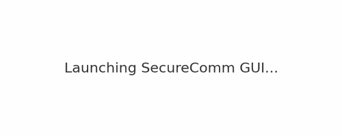

# Secure Communications System



## 🚨 Mission-Critical Secure Communications

This project provides a **robust, cross-platform, offline-capable** communication system built for **paramilitary, emergency response, and secure operations units**.

- 🔐 Military-grade encryption using GPG
- 🌍 Works on Linux, macOS, and Windows
- 📦 Distributed as `.deb`, `.exe`, and `.AppImage`
- 🛰️ Offline-capable, air-gapped mode ready
- 🧰 Modular, automated, and CI/CD integrated

---

## 🛠️ Quick Start

### Linux/macOS
```bash
git clone https://github.com/paracryptid/secure-communications.git
cd secure-communications
pip install -r requirements.txt
python app.py
```

### Windows
```bash
git clone https://github.com/paracryptid/secure-communications.git
cd secure-communications
py -m pip install -r requirements.txt
py app.py
```

---

## 📦 Installers

| Platform | Package | Status |
|----------|---------|--------|
| Debian/Ubuntu | `.deb` | ✅ To be added |
| Windows | `.exe` | ✅ To be added |
| Linux (Portable) | `.AppImage` | ✅ To be added |

---

## 🔐 Features

- GPG-secured communication
- Offline mode for air-gapped environments
- GUI and CLI interface
- Real-time message log viewer
- Role-based access model
- Fully test-covered with `pytest`
- CI/CD with GitHub Actions

---

## 🧪 Testing
```bash
pytest
```

---

## 🧱 Project Structure

```
.
├── app.py               # Main app
├── tests/               # Pytest test suite
├── requirements.txt     # Python dependencies
├── documentation/       # Extended guides
├── offline_support/     # Air-gapped functionality
├── ci_cd/               # CI/CD scripts
├── configurations/      # Config files
```

---

## 📄 Documentation

- [Installation Guide](INSTALL.md)
- [Usage Manual](USAGE.md)
- [Security Protocols](SECURITY.md)
- [Developer Guide](CONTRIBUTING.md)

---

## 📣 Contributing

We welcome contributions. Read [CONTRIBUTING.md](CONTRIBUTING.md) and submit a pull request.

---

## 📜 License

Licensed under [MIT](LICENSE).

---

> Maintained by [@paracryptid](https://github.com/paracryptid)
